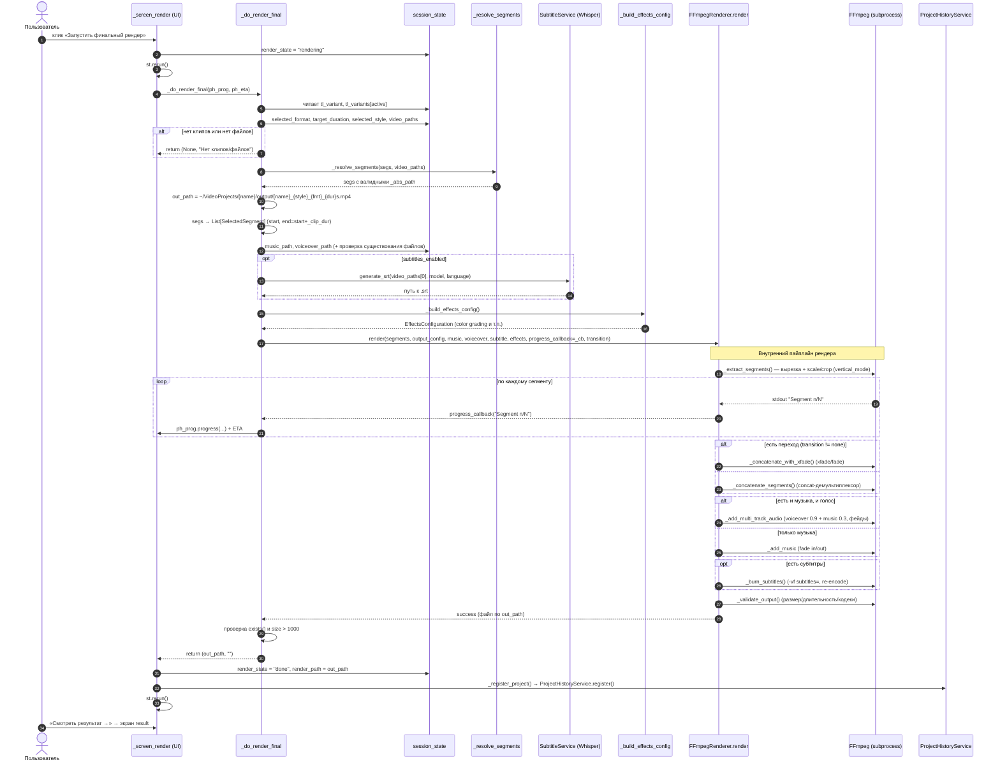

# AI Video Producer — Архитектура, методы и пользовательский путь

> Документ-референс для анализа проекта сторонней нейросетью.
> Цель: дать полное и **точное** понимание того, что реально реализовано в
> текущем продукте (а не задумано), чтобы можно было сформировать ТЗ на
> доработку/переработку алгоритмов монтажа.
>
> Дата составления: 2026-06-20. Версия кода — ветка на момент написания.
> Все пути, имена функций и формулы взяты из исходников, а не из памяти.

---

## 0. TL;DR для ревьюера

- Продукт — **wizard-приложение на Streamlit** (`frontend/app.py`, ~3500 строк):
  пользователь загружает видео → ИИ анализирует кадры → определяется
  «концепция» → выбирается стиль и формат → собирается **черновой монтаж**
  (4 варианта) → превью → финальный рендер через FFmpeg.
- **Важно:** в проекте сосуществуют ДВА движка монтажа:
  1. **Активный** — `frontend/app.py::_build_timeline()` (именно он работает в
     продукте; простой, эвристический).
  2. **Дремлющий** — `backend/services/timeline_service.py` +
     `src/clip_selection/strategies/*` + `src/clip_selection/ordering_engine.py`
     (богаче, покрыт тестами, но **не подключён** к текущему UI; остался от
     предыдущего поколения / legacy `src/gui.py`).
- Основные алгоритмические точки роста сосредоточены в активном движке: отбор
  клипов, скоринг, упорядочивание под сюжет, бит-синхронизация. Подробности —
  раздел 6 и раздел 10.

---

## 1. Технологический стек

| Слой | Технологии |
|------|-----------|
| UI | Streamlit (тёмная тема), HTML/CSS-инъекции, `streamlit-sortables` (drag-and-drop) |
| Анализ видео | OpenCV (`opencv-python`), `scenedetect`, NumPy/SciPy |
| Анализ контента | MediaPipe (лица), saliency, эстетический скоринг, `imagehash` (дубли) |
| Анализ музыки | `librosa` (BPM, биты, энергия, секции) |
| Интеллект | собственные rule-based службы (`analysis/intelligence/*`) |
| Хранилище | SQLAlchemy + Alembic (SQLite-кэш анализа) |
| Рендер | FFmpeg (через subprocess), `src/ffmpeg_renderer.py` |
| Субтитры | `openai-whisper` (опционально) |

Точка входа: `frontend/app.py::main()` → роутер `_MAP` по `session_state["screen"]`.
Скрипт запуска: `run_app.sh` (`streamlit run frontend/app.py --server.port 8502`).

---

## 2. Высокоуровневая архитектура

```
┌─────────────────────────────────────────────────────────────────┐
│  FRONTEND (Streamlit wizard)  —  frontend/app.py                  │
│  10 экранов, session_state, _build_timeline (АКТИВНЫЙ монтаж)     │
└───────────┬───────────────────────────────────┬─────────────────┘
            │ analyze_project()                  │ render()
            ▼                                    ▼
┌─────────────────────────────┐    ┌────────────────────────────────┐
│ backend/services             │    │ src/ffmpeg_renderer.py          │
│  AnalysisService             │    │  FFmpegRenderer (extract→concat │
│  VideoIntelligenceService    │    │   →music→subtitles→validate)    │
│  ScoringService              │    └────────────────────────────────┘
│  SubtitleService             │
│  ProjectHistoryService       │    ┌────────────────────────────────┐
│  TimelineService  (ДРЕМЛЕТ)  │    │ analysis/intelligence           │
└───────────┬─────────────────┘    │  ConceptService (концепция)     │
            │                       │  StyleFitService (фит под стиль)│
            ▼                       │  SegmentFeatureBuilder          │
┌─────────────────────────────┐    └────────────────────────────────┘
│ analysis/video, analysis/    │
│  content, analysis/music     │    ┌────────────────────────────────┐
│  SceneDetector, QualityEngine│    │ infrastructure/database          │
│  Blur/Shake/Face/Saliency    │    │  SQLAlchemy models + repos +     │
│  BPM/Beat/Energy/Section     │    │  Alembic (кэш по file_hash)      │
└─────────────────────────────┘    └────────────────────────────────┘

         src/clip_selection/strategies/*  +  ordering_engine.py
                  (ДРЕМЛЕТ — не вызывается из frontend)
```

### Что реально подключено к продукту

Импорты `frontend/app.py` (единственный источник истины о «живом» коде):

| Модуль | Где вызывается | Назначение |
|--------|---------------|-----------|
| `backend.services.analysis_service.AnalysisService` | экран `analysis` | весь конвейер анализа видео |
| `analysis.intelligence.concept_service.ConceptService` | экран `concept` | определение концепции ролика |
| `analysis.intelligence.style_fit_service.StyleFitService` | `_build_timeline` | скоринг фрагмента под стиль |
| `analysis.music.beat_detector.BeatDetector` | `_build_timeline` | биты для бит-синхронизации |
| `src.ffmpeg_renderer.FFmpegRenderer` | экраны `preview`/`render` | извлечение клипов и сборка видео |
| `src.segment_selector.SelectedSegment` | `preview`/`render` | модель клипа для рендера |
| `src.effects_config`, `src.config_loader.OutputConfig` | `render` | конфиг эффектов и вывода |
| `backend.services.subtitle_service.SubtitleService` | `render` | субтитры (Whisper) |
| `backend.services.project_history_service` | `result` | история проектов |

**НЕ импортируется фронтендом** (и потому в продукте не работает):
`backend/services/timeline_service.py`, весь `src/clip_selection/strategies/*`,
`src/clip_selection/ordering_engine.py`, `src/timeline/*`, `src/music_sync/*`,
`src/presets/*`, `src/easy_mode/*`, `src/gui.py` (старый UI).

---

## 3. Полный пользовательский путь (10 экранов)

Порядок задаётся `STEPS` (frontend/app.py); роутер — `_MAP`.

| # | Экран (key) | Что делает пользователь | Что происходит под капотом |
|---|-------------|------------------------|----------------------------|
| 1 | `upload` (Загрузка) | загружает видеофайлы (+ опц. музыку, закадровый голос) | файлы кладутся в проект, считаются пути |
| 2 | `analysis` (AI Анализ) | жмёт «Запустить AI-анализ», ждёт | `AnalysisService.analyze_project()` — детект сцен, метрики качества, контент, дубли, кэш по `file_hash` |
| 3 | `scenes` (Просмотр сцен) | смотрит сцены, фильтрует, пинит/исключает | формируются `scene_fragments` + `scene_actions` (pinned/included/excluded/forbidden) |
| 4 | `concept` (Концепция) | видит авто-определённую концепцию | `ConceptService.infer()` → `concept_type`, `narrative_arc`, `energy_profile` |
| 5 | `style` (Стиль) | выбирает один из 8 пресетов стиля | `selected_style` (см. `_STYLE_PRESETS`) |
| 6 | `format` (Формат) | выбирает соотношение/разрешение | `_FORMAT_OPTIONS`; по «Построить черновик» → `_build_timeline()` |
| 7 | `timeline` (Черновик) | смотрит 4 варианта монтажа, **переставляет/удаляет/меняет длину клипов** | `tl_variants` (A/B/C/D), drag-and-drop, ↑↓, редактор длительности |
| 8 | `preview` (Превью) | генерирует быстрое превью (480p) | `FFmpegRenderer.render_fast_preview()` |
| 9 | `render` (Рендер) | запускает финальный рендер (+субтитры/голос) | `FFmpegRenderer.render()` в целевом формате |
| 10 | `result` (Результат) | скачивает видео, видит историю | `ProjectHistoryService`, файл в `~/VideoProjects/{name}/output/` |

Навигация — линейная вперёд/назад (`_go`, `_back`), `_wizard_bar()` рисует
полосу шагов.

---

## 4. Конвейер обработки данных (data pipeline)

```
видеофайлы
   │  AnalysisService.analyze_project(abs_paths, force)
   ▼
для каждого файла  →  _analyze_one_video(abs_path):
   SceneDetector.detect()                     → список сцен [start_s, end_s]
   для каждой сцены:
     QualityEngine.analyze()                  → sharpness, brightness, contrast,
                                                 motion_magnitude, colorfulness…
     BlurDetector.score()                     → blur_score, is_blurry
     ShakeDetector.score()                    → camera_shake, camera_motion_type
     FaceDetector.detect()  (опц.)            → has_face, has_person…
     SaliencyDetector.score() (опц.)          → saliency_score
     AestheticScorer.score() (опц.)           → aesthetic_score
     _compute_ums(frag)                       → quality_score (Unified Media Score)
     _generate_thumbnail()                    → миниатюра
   VideoIntelligenceService.enrich(frags)     → semantic_tags, suggested_role,
       (fallback SegmentFeatureBuilder)         energy, composition_score, vi_score
   ScoringService.apply_scores(frags)         → пересчёт quality_score с VI-данными
   │
   ▼  дедупликация по perceptual hash (_phash), последовательные id
fragments[]  → session_state["scene_fragments"]
   │
   ▼  ConceptService.infer(fragments)         → video_concept (ConceptResult)
   │
   ▼  _build_timeline()                        → tl_variants {A,B,C,D}
   │
   ▼  FFmpegRenderer.render(SelectedSegment[]) → итоговый MP4
```

### Схема словаря фрагмента (ключевые поля)

Один «фрагмент» (= сцена-кандидат) — это `dict` со следующими сигналами,
которыми оперируют все алгоритмы монтажа:

```
{
  "id": int,                      # последовательный
  "source": "clip.mp4",           # имя исходника
  "_abs_path": "/abs/clip.mp4",
  "start_s": float, "end_s": float, "duration_s": float,
  # --- качество (QualityEngine) ---
  "sharpness": 0..1, "brightness": 0..1, "contrast": 0..1,
  "motion_magnitude": 0..1, "colorfulness": 0..1,
  "blur_score": 0..1, "is_blurry": bool,
  "camera_shake": 0..1, "camera_motion_type": "static|pan_left|zoom_in|shake|aerial…",
  # --- контент (опц.) ---
  "has_face": bool, "has_person": bool,
  "saliency_score": 0..1, "aesthetic_score": 0..1,
  # --- Video Intelligence ---
  "semantic_tags": ["nature","drone",…], "scene_tags": [...],
  "suggested_role": "intro|body|outro",
  "energy": "low|medium|high|dynamic", "energy_score": 0..1,
  "composition_score": 0..1, "vi_score": 0..1,
  # --- агрегаты/деривативы ---
  "quality_score": 0..1,          # UMS, главный балл качества
  "_style_score": 0..1,           # фит под текущий стиль (в _build_timeline)
  "_clip_dur": float,             # длительность клипа в монтаже
  "rejection_reason": str|None,   # причина отбраковки
  "is_duplicate": bool, "_phash": str,
  "thumbnail_rel_path": str
}
```

---

## 5. Состояние сессии (session_state) — ключевые ключи

| Ключ | Тип | Смысл |
|------|-----|-------|
| `screen` | str | текущий экран |
| `scene_fragments` | list[dict] | все проанализированные фрагменты |
| `scene_actions` | dict[id→str] | pinned / included / excluded / forbidden |
| `video_concept` | `ConceptResult`\|None\|False | концепция (False = анализ упал) |
| `selected_style` | str | id стиля (`_STYLE_PRESETS`) |
| `target_duration` | int | целевая длина ролика, сек |
| `audio_path` / `voiceover_path` | str | музыка / закадровый голос |
| `tl_variants` | dict[str→list[dict]] | A/B/C/D — списки клипов монтажа |
| `tl_variant` | str | активный вариант |
| `tl_beat_sync` | bool | включена ли бит-синхронизация |
| `preview_state` / `render_state` | str | стейт-машины превью/рендера |

---

## 6. Алгоритмы — детально (ядро для доработок)

### 6.1 Детект сцен
`analysis/video/scene_detector.py::SceneDetector.detect()` — `scenedetect` с
fallback на гистограммный метод (CV2). Возвращает список `{start_s, end_s}`.

### 6.2 Unified Media Score (UMS) — главный балл качества
`backend/services/analysis_service.py::_compute_ums(frag)`. Взвешенная сумма с
весами из конфига (`quality.weights`), нормированная на сумму применённых весов:

```
score = ( sharpness·0.35 + stability·0.25 + brightness·0.20 + contrast·0.20
        + motion·0.40 + saliency·0.50
        [+ aesthetic·0.60] [+ composition·0.40] [+ vi_score·0.50] ) / Σweights
stability = 1 − camera_shake
```
VI-компоненты добавляются только если присутствуют (≥0). Итог зажат в [0,1].
**Замечание для ревью:** веса заданы как константы по умолчанию в коде и в
конфиге; `motion` и `saliency` имеют высокий вес — это смещает отбор в сторону
«движения» и «заметности», а не сюжетной ценности.

### 6.3 Правила отбраковки
`_reject_reason(metrics, blur, shake)`: blurry → «Размытый кадр»; brightness <
`brightness_min` → «Слишком тёмный»; shake > 0.9 → «Сильная тряска». Плюс
дедуп по `_phash`. «Мягкие» косметические замечания (`tilted horizon`,
`cluttered background`) НЕ выбраковывают (см. `_SOFT_REJECTS` в `_build_timeline`).

### 6.4 Определение концепции
`analysis/intelligence/concept_service.py::ConceptService.infer()`:
- Агрегирует `semantic_tags`, `camera_motion_type`, `quality_score` по всем
  фрагментам.
- `_classify_concept()` — пересечение тегов с `_CONCEPT_RULES`
  (travel/wedding/sport/product/nature/event); аэросъёмка → travel/nature.
  Уверенность = `overlap / total_tags · 3`.
- `narrative_arc` берётся из `_NARRATIVE_ARC_MAP`:
  wedding→`three_act`, travel→`journey`, sport/event→`highlight_reel`,
  product/other→`montage`, nature→`journey`.
- `_classify_energy()` — по долям типов движения камеры → low/medium/high/dynamic.
- Требуется ≥ `MIN_CLIPS = 3`, иначе `None`.

### 6.5 Скоринг фита под стиль
`analysis/intelligence/style_fit_service.py::StyleFitService.compute_fit()`:
композит из 4 компонент с весами `motion 0.30 / semantic 0.35 / role 0.20 /
quality 0.15`. Правила стиля — `_STYLE_RULES` (preferred_motion, preferred_tags,
energy, min_quality). Возвращает `fit_score` + человекочитаемое объяснение.
**Важно:** в `_build_timeline` вызывается в `try/except: pass` — при сбое
`_style_score` тихо падает обратно на эвристику `_score_for_style()` (см. 6.6),
а та для неизвестного `style_id` возвращает почти `quality_score`.

### 6.6 Эвристический скоринг под стиль (fallback)
`frontend/app.py::_score_for_style(seg, style_id)`: если есть готовый
`style_fit_scores[style_id]` — берётся он; иначе профильные boost/penalty по
типу движения, тегам, лицам, резкости, яркости, тряске. База = `quality_score`.

### 6.7 СБОРКА МОНТАЖА — `_build_timeline()` (главный алгоритм продукта)

Поток:
1. **Фильтр пула** `_in_pool()`: pinned всегда; excluded/forbidden — нет;
   included — да; по умолчанию — только без `rejection_reason` (с учётом
   мягких замечаний). Если пул пуст — fallback на лучших по качеству.
2. **Обогащение** `StyleFitService` для текущего стиля → `style_fit_scores`.
3. `_score_for_style()` для каждого фрагмента → `_style_score`.
4. **Сортировка пула**: pinned вперёд, затем по `_style_score` ↓.
5. Разбиение по `suggested_role`: `intro_pool`, `outro_pool`, `body_pool`.
6. **Диверсификация по источнику**: `_max_per_src` ограничивает число клипов
   из одного файла (≈ `target/4` клипов на `N` источников), чтобы один ролик не
   доминировал. Лишние уходят в `deferred` и добираются, если не дотянули до
   65% цели.
7. **Длительность клипа** `_clip_dur()`: `min(end−start, 9)`, не короче 1.5с;
   при бит-синхронизации — `_snap_to_beat()` к ближайшей битовой метке (±0.15с).
8. **Жадное заполнение** до `target` (с порогами `×1.25`/`×1.35`).

**4 варианта** (`_variant(offset, …)`):

| Вариант | Параметр | Логика порядка тела |
|---------|----------|---------------------|
| **A** «Лучшее качество» | `prefer_quality` | сортировка по `quality_score` ↓ (детерминирован) |
| **B** «Под стиль» | `prefer_dynamic` | `0.5·_style_score + 0.25·quality + 0.25·_seg_dynamics` ↓ — независимый сигнал динамики добавлен, чтобы B не вырождался в A при сбое style-fit |
| **C** «Сюжет по концепции» | `prefer_intro_outro` | intro по скору → **`_order_body_by_arc(body, narrative_arc)`** → outro по скору |
| **D** «Случайный микс» | — | `rng.shuffle` (намеренно случайный) |

**Упорядочивание тела под сюжет** — `_order_body_by_arc(body, narrative_arc)`:
- `journey`/`three_act`/`story_arc`: спокойный establishing-кадр (динамика ≈0.45)
  → середина с нарастанием динамики → сильный финал (макс. балл).
- `highlight_reel`: лучшие моменты вперёд (`score + dynamics` ↓), высокая энергия.
- `montage`/default: ритмичное чередование спокойных/динамичных (лучшие первыми).
Детерминирован: одни данные + один нарратив → один и тот же порядок.

**Сигнал динамики** — `_seg_dynamics(seg)`: `motion_magnitude` → `energy_score`
→ оценка по `camera_motion_type` (static 0.1 … shake 0.8 … aerial 0.8), иначе 0.5.

Каждому варианту строится **edit_plan** (`_make_edit_plan`) с метриками
(n_clips, n_unique_sources, dominant_source_pct, total_duration) — для валидации
и отладки (логи `[Timeline] variant=…`).

### 6.8 Бит-синхронизация
`analysis/music/beat_detector.py::BeatDetector.detect()` → массив битов
(librosa). `_snap_to_beat()` подгоняет длину клипа к сетке битов. Бейдж
«🎵 Бит-синхронизация» на черновике, флаг `_beat_sync` на клипах.

### 6.9 Рендеринг (FFmpeg)
`src/ffmpeg_renderer.py::FFmpegRenderer`:
- `render(segments, output_config, output_path, music_path, voiceover_path,
  subtitle_path, effects_config, vertical_mode, between_clip_transition, …)`.
- Пайплайн: `_extract_segments()` (вырезка + масштаб/кроп) → конкатенация
  (`_concatenate_with_xfade()` при переходах, иначе быстрый concat-демультиплексор)
  → аудио (`_add_music` / `_add_multi_track_audio` voiceover 0.9 + music 0.3)
  → `_burn_subtitles()` → `_validate_output()`.
- Вертикальные режимы: `center_crop | fit_blur | left_crop | right_crop`.
- Переходы: `cut` (none) или `crossfade`/`xfade` с длительностью.
- Быстрое превью: `render_fast_preview()` (480p), стабилизация, watermark,
  миниатюры — отдельные методы.

---

## 7. Способы монтажа (montage methods) — сводка

**Активные (в продукте):**
- 4 стратегии вариантов: качество / под-стиль / сюжет-по-концепции / случайный.
- Сюжетные арки: `journey`, `three_act`, `highlight_reel`, `montage`
  (через `_order_body_by_arc`).
- Диверсификация по источникам, добор `deferred`, жадное заполнение под `target`.
- Бит-синхронизация длительностей.
- Переходы и темп задаются пресетом стиля (`_STYLE_PRESETS`: `transition`, `pace`).

**Дремлющие (есть в коде, но не подключены) — кандидаты к переносу в продукт:**
`src/clip_selection/ordering_engine.py::OrderingEngine` со стратегиями:
`chronological`, `best_first`, `energy_growth`, `smooth_progression`
(greedy nearest-neighbour по фичам), `story_arc`, `hook_then_fast_variation`,
`rhythmic_alternation`. Плюс `src/clip_selection/strategies/*` (travel_story,
event_highlights, sport_highlight_impact, intelligent_beauty, f6 и др.) и
`backend/services/timeline_service.py` как обёртка. Эти модули покрыты тестами
в `tests/` (например `test_timeline_full.py`, `test_variant_*`).

---

## 8. Use cases (поддерживаемые сценарии)

**Концепции** (авто): travel, wedding, sport, event, product, nature, other.
**Стили** (8, `_STYLE_PRESETS`): cinematic_nature, dynamic_travel, drone_smooth,
fast_reels, family_memories, luxury_promo, real_estate, fpv_action.
**Форматы** (`_FORMAT_OPTIONS`): YouTube Shorts/Reels/TikTok (9:16), YouTube/FullHD
(16:9), 4K, Square (1:1), Cinematic 2.35:1.
**Доп. дорожки:** фоновая музыка (+ бит-синк), закадровый голос (мультитрек),
субтитры (Whisper, tiny/base/small/medium).

Типичный сценарий: «турист загрузил 10 клипов с дрона и телефона, выбрал
Dynamic Travel + YouTube Shorts 30с → получил вертикальный ролик с музыкой».

---

## 9. Хранилище и кэширование

`infrastructure/database` — SQLAlchemy-модели (`SourceFile`, `ClipCandidate`,
`VideoConcept`, `SegmentStyleFit`, `MusicFragment` и др.) + репозитории + Alembic.
Кэш анализа — по `file_hash` (`SHA` файла): повторный анализ того же файла
берётся из БД (`is_analyzed`). Концепция и style-fit могут сохраняться в БД,
но фронт работает преимущественно через `session_state`.

---

## 10. Известные ограничения и точки роста (для ТЗ на доработку)

Это — самый ценный раздел для рекомендаций. Перечислено честно.

1. **Два параллельных движка монтажа.** Богатый `OrderingEngine` + стратегии
   `src/clip_selection/*` НЕ используются продуктом; работает упрощённый
   `_build_timeline`. Решение: либо подключить движок через
   `TimelineService`, либо перенести лучшие стратегии в активный путь.
2. **Отбор клипов — жадный и одномерный.** Сортировка по одному баллу +
   жадное заполнение. Нет глобальной оптимизации (покрытие сюжета,
   разнообразие планов, ритм). Кандидаты: beam search / ILP / DP по таймлайну,
   максимизация разнообразия (MMR), учёт ритма музыки на уровне отбора, а не
   только длительности.
3. **Слабая «сюжетность».** `narrative_arc` берётся только из типа концепции и
   влияет лишь на порядок тела варианта C. Нет реальной драматургии (хук →
   развитие → кульминация → развязка) с учётом семантики и эмоций. Кандидаты:
   перенос `story_arc`/`hook_then_fast` из `OrderingEngine`, эмоц. кривая.
4. **Малый пул → варианты совпадают по составу.** Когда клипов мало, A/B/C/D
   берут одни и те же клипы (отличается лишь порядок). Кандидаты: варианты
   разной длины/плотности/темпа, осознанный отказ от части клипов ради контраста.
5. **Скоринг качества (UMS) ≠ ценность для монтажа.** Высокие веса `motion`,
   `saliency`; нет учёта «интересности»/новизны кадра, повторов сюжета, лиц
   как нарративных якорей. Веса статичны.
6. **Тихие фолбэки.** `StyleFitService` и VI-обогащение завёрнуты в
   `except: pass` — при сбое качество деградирует незаметно (нет сигнала
   пользователю/в метрики).
7. **Семантические теги** — основной драйвер концепции и фита, но генерируются
   `VideoIntelligenceService`/`SegmentFeatureBuilder` эвристически (без сильной
   модели типа CLIP — он закомментирован в requirements). Это потолок точности
   концепции и подбора. Кандидат: подключить CLIP/видео-эмбеддинги.
8. **Переходы примитивны.** `cut`/`crossfade`; нет match-cut, motion-aware
   переходов, переходов в ритм.
9. **Бит-синхронизация — только длительность.** Снап длины клипа к битам, но
   нет акцентов/смены кадра на сильную долю, нет учёта секций трека
   (intro/drop/bridge), хотя `SectionDetector` уже существует.
10. **Нет обучения на обратной связи.** Перестановки/удаления пользователя на
    черновике не используются для подстройки скоринга.

---

## 11. Карта «где что лежит» (для точечных правок)

| Алгоритм / функция | Файл : символ |
|--------------------|---------------|
| Роутер экранов | `frontend/app.py` : `_MAP`, `STEPS`, `main()` |
| Сборка монтажа (активная) | `frontend/app.py` : `_build_timeline`, `_variant` |
| Порядок под сюжет | `frontend/app.py` : `_order_body_by_arc`, `_seg_dynamics` |
| Эвристика стиля | `frontend/app.py` : `_score_for_style` |
| Снап к битам | `frontend/app.py` : `_snap_to_beat` |
| Редактор черновика (drag/↑↓) | `frontend/app.py` : `_render_timeline_editor` |
| Конвейер анализа | `backend/services/analysis_service.py` : `analyze_project`, `_analyze_one_video` |
| UMS скоринг | `backend/services/analysis_service.py` : `_compute_ums` |
| Отбраковка | `backend/services/analysis_service.py` : `_reject_reason` |
| Пересчёт с VI | `backend/services/scoring_service.py` : `ScoringService.apply_scores` |
| VI-обогащение | `backend/services/video_intelligence_service.py`, `analysis/intelligence/segment_feature_builder.py` |
| Концепция | `analysis/intelligence/concept_service.py` : `ConceptService.infer`, `_CONCEPT_RULES`, `_NARRATIVE_ARC_MAP` |
| Фит под стиль | `analysis/intelligence/style_fit_service.py` : `compute_fit`, `_STYLE_RULES` |
| Детект сцен/качество | `analysis/video/{scene_detector,quality_engine,blur_detector,shake_detector}.py` |
| Контент | `analysis/content/{face_detector,saliency_detector,aesthetic_scorer}.py` |
| Музыка | `analysis/music/{bpm_detector,beat_detector,energy_analyzer,section_detector}.py` |
| Рендер | `src/ffmpeg_renderer.py` : `FFmpegRenderer.render`, `render_fast_preview` |
| Модель клипа рендера | `src/segment_selector.py` : `SelectedSegment` |
| Конфиг вывода/эффектов | `src/config_loader.py`, `src/effects_config.py` |
| **Дремлющий** движок упорядочивания | `src/clip_selection/ordering_engine.py` : `OrderingEngine` |
| **Дремлющие** стратегии отбора | `src/clip_selection/strategies/*.py` |
| **Дремлющая** обёртка таймлайна | `backend/services/timeline_service.py` |
| БД/кэш | `infrastructure/database/{models,repository}.py` + `migrations/` |
| Субтитры | `backend/services/subtitle_service.py` (Whisper) |

---

## 12. Как пользоваться этим документом для ТЗ

1. Раздел 6 + 7 — что и как монтируется сейчас (чтобы не ломать рабочее).
2. Раздел 10 — приоритезированный список доработок алгоритмов.
3. Раздел 11 — точные адреса правок.
4. При предложении нового алгоритма указывать: в какой движок встроить
   (активный `_build_timeline` или подключаемый `TimelineService`), какие поля
   фрагмента (раздел 4) он потребляет, и как влияет на 4 варианта/арки.

---

## 13. Диаграмма последовательности рендера

Точная последовательность от нажатия «Запустить финальный рендер» до готового
файла. Источник: `frontend/app.py::_screen_render` / `_do_render_final` и
`src/ffmpeg_renderer.py::FFmpegRenderer.render`.

### 13.1 Mermaid (sequenceDiagram)



### 13.2 ASCII-вариант (если Mermaid не рендерится)

```
Пользователь
   │ клик «Запустить финальный рендер»
   ▼
_screen_render ── render_state="rendering" ── st.rerun() ──► _do_render_final()
   │
   ├─ session_state: tl_variant, tl_variants[active]=segs, format, target, style, video_paths
   ├─ guard: нет segs / нет video_paths → return (None, ошибка)
   ├─ _resolve_segments(segs, video_paths)            → валидные _abs_path
   ├─ out_path = ~/VideoProjects/{name}/output/{name}_{style}_{fmt}_{dur}s.mp4
   ├─ segs → SelectedSegment[]  (start, end=start+_clip_dur, duration)
   ├─ music_path / voiceover_path  (+ проверка существования)
   ├─ [opt] subtitles_enabled → SubtitleService.generate_srt() (Whisper) → .srt
   ├─ _build_effects_config()                         → EffectsConfiguration
   │
   └─► FFmpegRenderer.render(segments, output_config, music, voiceover,
        subtitle, effects, progress_callback=_cb, between_clip_transition)
          │
          ├─ 1. _extract_segments()  ── вырезка + scale/crop (vertical_mode)
          │        └─ на каждый сегмент stdout "Segment n/N" → _cb → ph_prog.progress()
          ├─ 2. конкатенация:
          │        ├─ есть переход → _concatenate_with_xfade()  (xfade/fade)
          │        └─ иначе        → _concatenate_segments()    (concat demuxer, быстро)
          ├─ 3. аудио:
          │        ├─ music+voice → _add_multi_track_audio (voice 0.9 + music 0.3 + фейды)
          │        └─ только music→ _add_music (fade in/out)
          ├─ 4. [opt] _burn_subtitles()   (-vf subtitles=, re-encode)
          └─ 5. _validate_output()        (размер/длительность/кодеки)
          ▼
        файл по out_path
   ◄─ return (out_path, "")
   │
_screen_render ── render_state="done", render_path=out_path
   ├─ _register_project() → ProjectHistoryService.register()
   ▼
Пользователь ── «Смотреть результат →» ──► экран result (скачивание, история)
```

### 13.3 Превью vs финальный рендер

Превью (`_screen_preview`) использует тот же набор клипов, но вызывает
`FFmpegRenderer.render_fast_preview()` (480p, упрощённо, без субтитров) — быстрый
просмотр перед финалом. Финальный рендер (выше) идёт в целевом разрешении формата
с музыкой/голосом/субтитрами/эффектами. Прогресс обоих парсится из строки
`"Segment n/N"` в `progress_callback`.

**Точки внимания для доработки рендера:** переходы ограничены `xfade/fade`
(нет match-cut/motion-aware); субтитры жгутся одним проходом по `video_paths[0]`
(не по смонтированной дорожке — возможна рассинхронизация при перестановке
клипов); прогресс оценивается линейно по числу сегментов (без учёта реальной
стоимости фильтров).

